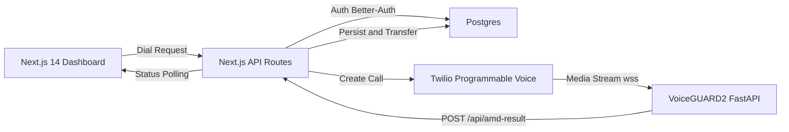

# Advanced Answering Machine Detection (AMD) Platform

End-to-end outbound calling platform that combines a Next.js 14 dashboard/API with a FastAPI microservice wrapping the VoiceGUARD2 AMD model. Calls originate from Twilio, stream real-time audio into the Python service for human vs. machine detection, and update a live React dashboard backed by Postgres.

## Core Capabilities
- Automates outbound dialing with optional VoiceGUARD2 or Twilio-native AMD strategies.
- Streams Twilio audio into a dedicated microservice for low-latency inference.
- Persists call metadata, AMD events, and user sessions in Postgres via Prisma.
- Provides a secure dashboard for initiating calls and monitoring statuses in real time.
- Ships with unit, integration, and telephony regression tooling for confidence in changes.

## Architecture Overview



## Repository Structure
- `app/` – Next.js App Router UI + API endpoints.
- `components/` – Dashboard UI components.
- `lib/` – Auth, Prisma, and Twilio helpers.
- `python-amd-service/` – FastAPI microservice, model loader, Dockerfile, tests.
- `prisma/` – Database schema and migrations.
- `scripts/` – Vitest and telephony regression harnesses.
- `docs/` – Operational runbooks and supporting documentation.

## Prerequisites
- Node.js 18 or newer.
- pnpm/npm (repository uses npm scripts by default).
- Python 3.10+ with `pip`, or Docker.
- Postgres 14+ (local or managed provider).
- Twilio account with Programmable Voice, a verified outbound number, and media streams enabled.
- Access to the VoiceGUARD2 model artifact (`VOICEGUARD_RELEASE_URL`).

## Environment Configuration

### 1. Next.js / API (`.env.local`)

| Variable | Required | Description |
| --- | --- | --- |
| `DATABASE_URL` | ✓ | Postgres connection string (use `?sslmode=require` when hosting in the cloud). |
| `AUTH_SECRET` | ✓ | Random 32+ character string for Better-Auth session signing. |
| `NEXT_PUBLIC_APP_URL` | ✓ | Public HTTPS base URL used by Twilio webhooks (ngrok/Cloudflare tunnel in dev). |
| `AUTH_URL` | optional | Override Better-Auth callback origin (automatically inferred if omitted). |
| `TWILIO_ACCOUNT_SID` | ✓ | Twilio project SID. |
| `TWILIO_AUTH_TOKEN` | ✓ | Twilio auth token (also used for webhook signature validation). |
| `TWILIO_PHONE_NUMBER` | ✓ | E.164 formatted caller ID purchased or verified in Twilio. |
| `TWILIO_HUMAN_GREETING_URL` | optional | URL to an MP3/WAV greeting played when a human is detected. |
| `PYTHON_SERVICE_URL` | ✓ for VoiceGUARD2 | Base URL to the FastAPI service. Accepts `https://...` or `wss://...`. |
| `PYTHON_SERVICE_API_KEY` | ✓ if set on Python service | Shared secret for securing WebSocket + `/api/amd-result`. |
| `VOICEGUARD_RELEASE_URL` | optional | Mirrors Python microservice value for convenience scripts. |
| `TEST_PERSONAL_NUMBER` | optional | Human verification number for `npm run call:test-amd`. |

> Copy `.env.example` into `.env.local` and update values before running the app locally.

### 2. Python AMD Service (`python-amd-service/.env`)

| Variable | Required | Description |
| --- | --- | --- |
| `API_KEY` | ✓ if securing traffic | Must match `PYTHON_SERVICE_API_KEY` in the Next.js app. |
| `RESULT_CALLBACK_URL` | ✓ | Public URL for posting detections (e.g. `https://app.example.com/api/amd-result`). |
| `MODEL_PATH` | optional | Directory used to cache the VoiceGUARD2 weights (defaults to `models/cache`). |
| `VOICEGUARD_RELEASE_URL` | ✓ | HTTPS link to the VoiceGUARD2 release artifact (.tar/.zip). |
| `AUDIO_BUFFER_SECONDS` | optional | Sliding window size for inference (default `2.0`). |
| `CONFIDENCE_THRESHOLD` | optional | Minimum confidence before emitting a detection (default `0.75`). |
| `SILENCE_TIMEOUT_SECONDS` | optional | Fallback when no speech arrives (default `5`). |
| `FALLBACK_STRATEGY` | optional | Label emitted on timeout (`human` or `machine`). |
| `TWILIO_SAMPLE_RATE` | optional | Expected PCM sample rate (`8000` for μ-law). |

### 3. Cloudflare Deployment Notes
- When fronting the Next.js app with Cloudflare (Pages, Workers, or Zero Trust Tunnel), define the same environment variables inside the Cloudflare dashboard or via `wrangler.toml` secrets (`wrangler secret put AUTH_SECRET`, etc.).
- Set `NEXT_PUBLIC_APP_URL` to the Cloudflare-managed HTTPS hostname so Twilio webhooks resolve correctly.
- If using Cloudflare Zero Trust Tunnels for local testing, export the `CLOUDFLARE_TUNNEL_TOKEN` and run `cloudflared tunnel run <name>` in parallel with `npm run dev`. Twilio must target the tunnel URL.
- Cloudflare often terminates TLS; ensure the Twilio media stream target (`PYTHON_SERVICE_URL`) is publicly reachable and not proxied through Cloudflare unless WebSockets are explicitly allowed.
- For Cloudflare-managed Postgres (or other secure proxies), append `?sslmode=require` to `DATABASE_URL` and supply the certificate bundle via secret storage if required.

## Twilio Console Configuration
1. **Create/Verify Numbers**
   - Purchase or verify a programmable voice number (“From” matches `TWILIO_PHONE_NUMBER`).
2. **Programmable Voice Application**
   - Voice > Manage > TwiML Apps → Create new.
   - Set Voice URL to `POST https://<your-domain>/api/twiml/connect-stream`.
   - Set Status Callback URL to `POST https://<your-domain>/api/webhooks/call-status`.
3. **Media Streams**
   - Enable “Stream to WebSocket” and confirm the region; Twilio will deliver `CallSid` in query params.
4. **Call Recording / SIP Domains (optional)**
   - Disable unless explicitly needed; recordings add storage/PII obligations.
5. **Allowlisted Destinations**
   - In trial accounts, verify every destination number you plan to dial.
6. **Secure Webhooks**
   - Ensure your public domain is HTTPS and accessible (ngrok, Cloudflare Tunnel, or production host).
   - Twilio will validate responses; mismatches return 11200 series errors.

## Local Development Workflow

1. **Install Dependencies**
   ```bash
   npm install
   ```

2. **Apply Prisma Schema**
   ```bash
   npm run prisma:generate
   npm run prisma:migrate
   ```

3. **Seed VoiceGUARD2 Model & Start FastAPI Service**
   ```bash
   cd python-amd-service
   pip install -r requirements.txt
   python -m scripts.download_voiceguard_release
   uvicorn app:app --reload --port 8000
   ```

   The download script caches weights to `models/cache` and validates the load step. Adjust ports via `--port` if `8000` is unavailable.

4. **Launch Next.js App**
   ```bash
   cd /Users/m3bionix/Projects/AMD
   npm run dev
   ```

5. **Expose Webhooks (optional)**
   ```bash
   # ngrok example
   ngrok http 3000

   # Cloudflare Tunnel example
   cloudflared tunnel run amd-local
   ```

   Update `NEXT_PUBLIC_APP_URL` (and `RESULT_CALLBACK_URL` inside `python-amd-service/.env`) with the public HTTPS URL.

6. **Trigger a Call**
   - Register/login at `http://localhost:3000`.
   - Use the dashboard to dial an E.164 number and monitor the call timeline.

## Docker & Compose
- `python-amd-service/Dockerfile` builds a slim Python 3.10 image, installs ffmpeg + dependencies, downloads VoiceGUARD2 weights via build arg `VOICEGUARD_RELEASE_URL`, and runs `uvicorn` on port `8000`.
- `docker-compose.yml` provisions:
  - `python-amd` (FastAPI service) with model cache volume and callback wiring to the host Next.js app.
  - `postgres` (local database for development).

### Build & Run
```bash
VOICEGUARD_RELEASE_URL=https://example.com/voiceguard.tar.gz docker-compose up --build
```

Expose your Next.js app separately (`npm run dev`) and ensure `PYTHON_SERVICE_URL` points to `http://localhost:8000` (or the compose hostname `http://python-amd:8000` when everything runs in containers).

## Testing & QA
- `npm run lint` – ESLint across the Next.js project.
- `npm run test` / `npm run test:watch` – Vitest unit coverage.
- `python -m pytest python-amd-service/tests` – Python unit tests.
- `npm run call:test-amd` – Smoke test dialing curated voicemail numbers via Twilio (requires valid credentials and `TEST_PERSONAL_NUMBER` for human verification runs).
- `npm run call:test-suite` – Extended regression that records confidence metrics for analysis.

## Deployment Considerations
- **Next.js App**
  - Deploy to Vercel, AWS, or Cloudflare Pages (Node runtime). Ensure environment variables and database connectivity are configured per environment.
  - Enforce HTTPS and rate limiting around `/api/dial` and `/api/amd-result` (proxy/layer-7 firewall).
- **Python AMD Service**
  - Deploy container images to ECS, GKE, Fly.io, etc. Provide persistent volume for `models/cache` or bake artifacts into the image.
  - Add readiness (`/health`) and liveness probes, plus metrics/log forwarding.
- **Database**
  - PostgreSQL with sensible connection pooling (PgBouncer). When hosting behind Cloudflare or other proxies, configure TLS certificates and `sslmode` accordingly.
- **Secrets Management**
  - Store Twilio keys, `AUTH_SECRET`, and `PYTHON_SERVICE_API_KEY` in your secret manager (AWS Secrets Manager, Cloudflare Secrets, Doppler, etc.). Avoid committing them to Git.

## Operations & Troubleshooting
- VoiceGUARD2 fallback activates automatically when `/health` is unreachable; monitor logs in `app/api/dial/route.ts` for transition messages.
- Twilio webhook signature mismatches return HTTP 401; confirm `TWILIO_AUTH_TOKEN` matches the console value and that Cloudflare/ngrok preserves the original host header.
- If detections never arrive, verify the Python service logs for `Rejected stream` messages—this indicates `API_KEY` mismatch in the WebSocket query or Twilio parameter.
- Adjust `CONFIDENCE_THRESHOLD` and `AUDIO_BUFFER_SECONDS` to tune latency vs. accuracy; update documentation in `docs/` after changes.
- Use the telemetry stored in the `Call` and related `AmdEvent` tables to audit performance or raise alerts.

## Reference Material
- `docs/telephony-playbook.md` – Detailed telephony runbook.
- `app/api/twiml/connect-stream` – TwiML generator for VoiceGUARD2 media streams.
- `app/api/amd-result` – Detection webhook (closes or transfers Twilio calls).
- `python-amd-service/tests/test_audio_processor.py` – Core buffering logic coverage.
- [VoiceGUARD2 Releases](https://github.com/Mrkomiljon/VoiceGUARD2) – Source of the model artifact referenced by `VOICEGUARD_RELEASE_URL`.

Questions, improvements, and tuning experiments are welcome—update this README and the runbooks when you discover better defaults or new operational steps.
